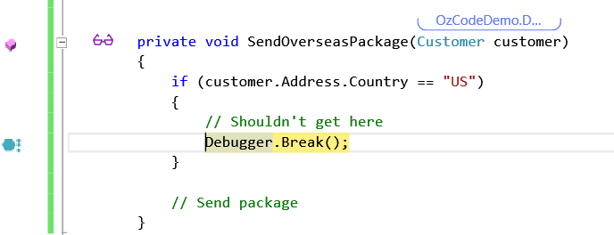
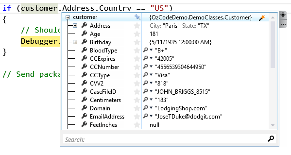
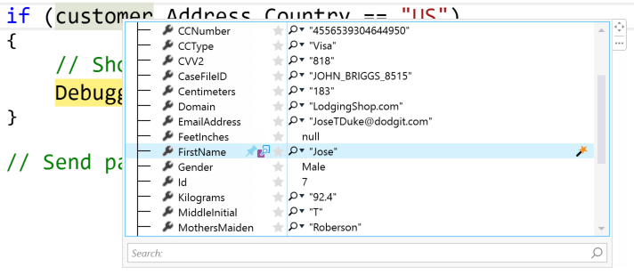
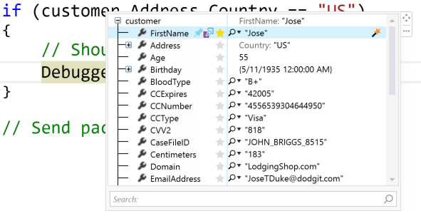
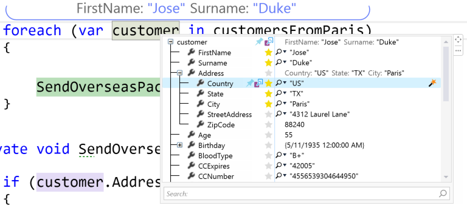

#Reveal
**Focus on data that actually matters**   

##Overview
Objects can have many properties, but when debugging, not all of them are useful to you. You’re usually interested only in a select few. For a Customer class, it might be the ID and FullName properties. For a Point in 3D space, it might be the X, Y, and Z fields. With OzCode's ***Reveal*** feature, you can finally focus on the data that actually matters. 
##Using Reveal
In order to run this demo press the _Reveal_ button in the demo application.  
  

Notice that a breakpoint has been triggered. 
It seems that although we're in a method that should only be used to send packages outside of the country (US), somehow we got a package that should have been shipped using a local shipping method:  

  
Because nobody bothered to implement `ToString` on the Customer class, initially, the HUD will use the default `ToString` implementation, which just shows the type name, and is not very useful. Further, traversing the _Customer_ class in the DataTip can be a pain, because it contains so many fields.

Hover your mouse over `customer` for the DataTip window appears. Then expand the cutomer fields using the '+'. 

 

Lastly find "FullName" and click on the "*star*" next to it:   

 

Notice how the DataTip window and the HUD updated accordingly:

  
Use the [Call Stack Window](https://msdn.microsoft.com/en-us/library/a3694ts5.aspx) to go back to the caller of the method, and use the DataTip again to see how many customers are from *Paris* (including Jose Duke).
Since they're all instances of _Customer_, the _FullName_ which we've previously stared is shown automatically. 

 

Let's add some more information on each customer: From the DataTip window - expand one of the customers, then expand the _Address_ propery and star the _Country_, _State_ and _City_ properties.
Lastly toggle the Star next to _Address_ as well - in order to show _Address_ information as part of _Customer_ (making it much easier to see the nested information!).

Collapse the current customer and look at the customer list: Now we can see all of the selected customers and their addresses. 

Finding the bug and the affected customers should be simple.

[Back to Main](../../README.md)
