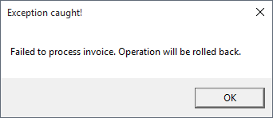
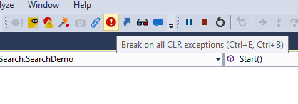
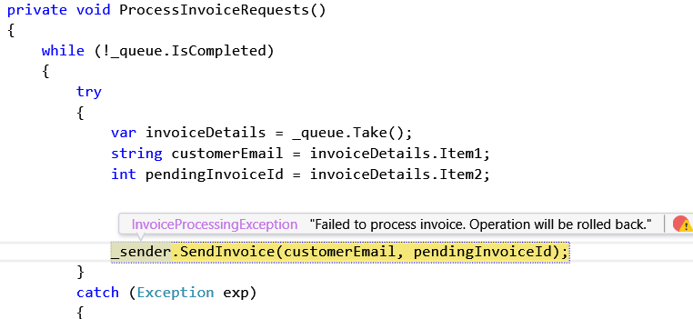
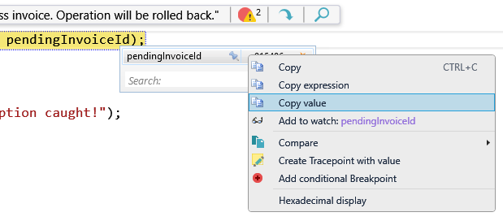
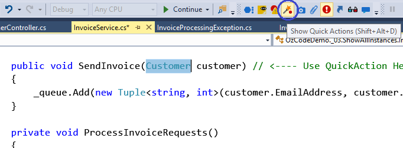
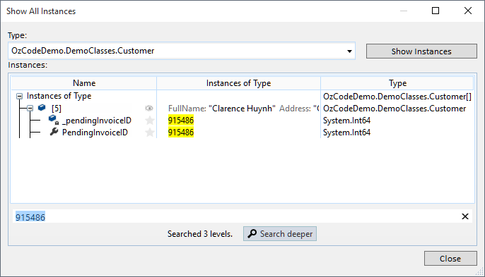
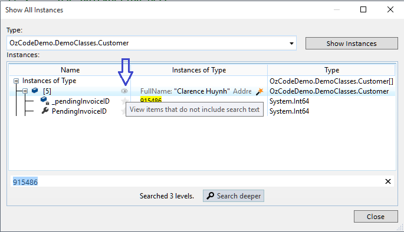
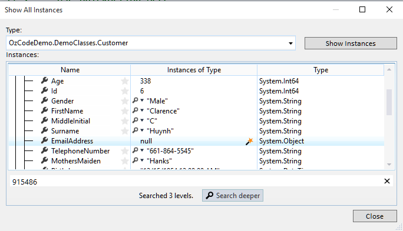

#Show All Instances
**Find specific objects in memory that you want to explore**

##Overview
OzCode makes it trivial to find specific objects in memory that you want to explore. Just open ***Show All Instances of Type***, and you’ll be able to see every object of that type that’s currently in memory. Why is that object still in memory? Are there any objects that contain this value? OzCode’s exciting new exploration tool effortlessly and instantly answers these questions and more.
##Using Show All Instances
In order to run this demo click the _Show All Instances_ button in the demo application.  
   

Immediatly a message box pops since an exception was thrown:

 
 Not very informative and we need to investigate this problem further.  
 
 To understand the problem we need to break when the exception is thrown, and so we can either use Visual Studio's built in exception settings dialog, or simply click the "Break on all CLR excetions" button:

  
Re-run the sample - you should break on _SendInvoice_ call:

A quick check should show the problem with this method call --> __customerEmail is null__ which should not happen.

Unfortunalty _InvoiceService_ implementation makes it hard for us to find which _Customer_ caused the problem. And although we can quickly fix this issue by adding a check, we still need to find the offending customer!
Since we only have the _invoiceID_ we can look for it using OzCode's ***Search***.  

Use the watch to view __pendingInvoiceId__ and choose 'Copy Value':

Then, put your caret on the word 'Customer' (the class name) above, open the ***QuickActions*** menu:

Choose 'Show all instaces of Customer' to make the dialog appear.
Paste the invoice value in the seatch box (buttom) to search for the _invoiceID_ you just copied:

Using the little 'eye' we can expand the selected customer to see all of the instance properties, and look for the _emailAddress_

Finally we can see that that customer was loaded without an _emailAdress_ which means that we might have a data curruption problem on our hands.

[Back to Main](../../README.md)
