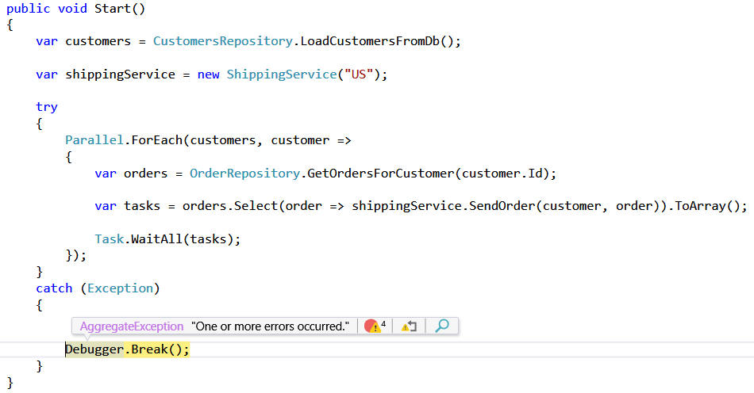
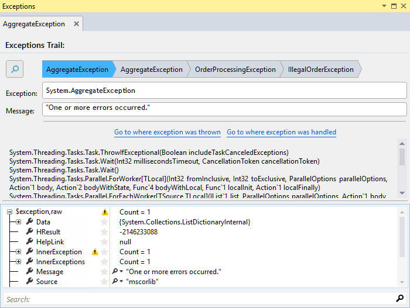
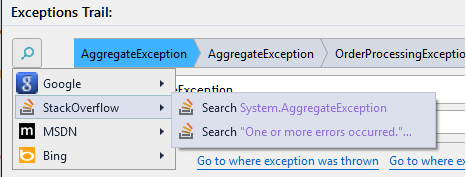

#Exception Trail
**Effortlessly understand the root cause of a bug by instantly navigating to the *inner-most* InnerException, and drill into the exception's callstack and associated data.**
##Overview
Without OzCode, investigating an exception is a dreary task -  navigating through a trail of inner exceptions, scrolling through lengthy callstacks, and squinting through the exception’s associated data to try to make sense of the error. With OzCode, all the relevant information about the exception is presented in a handy tool-window. You can navigate through each inner-exception with a super- convenient breadcrumb control, and even launch a Google or stackoverflow search right from within Visual Studio!
##Using Exception Trail
In order to run this demo click the _Exception Trail_ button in the demo application.  
**Note: For this demo make sure that break on exceptions is turned off**   

It may take a few tries but after a while you should break after an exception was caught: 

Open the exception trail by selecting  _View exception details_ from the bar or from the _quick actions_ menu (on the side).

We can see the exception details in a glance - there are three inner exceptions and the first exception thrown was an IllegalOrderException.
From here we can navigate the inner exceptions easily, as well as search for additional information about the exception type or message through one of the supported providers:

Another time saving feature is the ability to go to where the exception was thrown - quickly finding the root cause of the problem. You can do so either from the _Excpetion details dialog_ or from the exception bar.

You will arrive at the exception origin without needing to traverse the exception and its inner exceptions.

 [Back to Main](../../README.md)  
