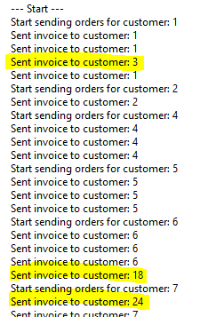
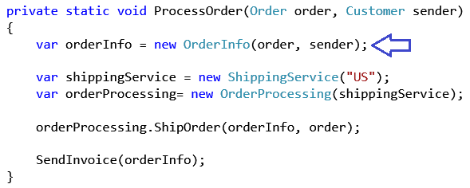

#When Set... Break
** Do you ever scratch your head while debugging, asking yourself "Where did the value of this property come from?". Next time, just create a Setter Point! When the property value is changed, OzCode will break into the debugger, allowing you to inspect the state of the program and figure exactly why that problematic value got there in the first place!**
##Overview
The toughest bugs to figure out are those that involve mutating state. What do you do if at some point during the program’s execution, the state of some objects becomes invalid, but you have no idea exactly *when* and *how* they got that way? While inspecting values in the debugger, when you spot a problematic property value, use the Magic Wand and choose “When Set -> Break”. The next time the property value is changed, OzCode will break into the debugger and allow you to inspect the state of the program, and figure exactly how that problematic value got there in the first place! These Setter Breakpoints work on both regular properties and auto-properties, and you can even add a Setter Breakpoint on properties you don’t have the source code to!
##Using When Set... Break
In order to run this demo click the _When Set... Break_ button in the demo application.  


After the run has finished, a log message will show. Going over the log messages, you can notice a problem: it seems that certain customers were mistakingly billed for other people's orders (invoices sent). Ouch!



A quick glance through the code will show that the customer we're going to send the bill to is taken out of the _OrderInfo.Customer_, which is initialized during the object construction in the begining of _ProcessOrder_:



Clearly someone has changed the Customer property somewhere (by mistake). That person should be fired! ;)
But now we have two choices - we either run the program line by line until we find the offending line (or lines) of code, or use OzCode's _When Set_ feature (hint, hint).

- To use the feature, we first need to stop after `orderInfo` was created. Run the demo again until you reach the breakpoint, and hover over the newly created _OrderInfo_ instance.
- Now expand the `OrderInfo` object's properties, and hover over _Customer_
- Move your pointer over the Magic Wand that appears
- Choose _Break_ from the _When Set_ menu

 
 
The following dialog will appear:


    
Since we want to break on any `OrderInfo` instance, leave the first radio button checked.  
The problem is that we don't want to break on the initial object creation (where `Customer` property is also set), so in-order to refine the breakpoint, add the following condition:
```
this.Customer != null 
```
When setting the condition two special keywords can be used:
- __value:__ the new value that is about to be set
- __this:__  the object which contains the property that is about to be set  

_Note: Using `this` and `value` in the condition simple and easy since there is full IntelliSense support!_   

And so false positives are eliminated by removing the cases in which the value is just being initialized:

   

Click 'OK' to set the new breakpoint, and then hit F5.

_Don't forget to remove the "regular" breakpoint so that the execution won't stop on every single iteration._  

Once the new breakpoint is triggered we can use _Reveal_ to see the new data:
Just move the mouse pointer over the new value and "star" the information you want to see.


Find the root cause of the bug by going back to the calling method (_OrderProcessing.ShipOrder_), using the StackTrace:


 [Back to Main](../../README.md)  
