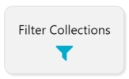
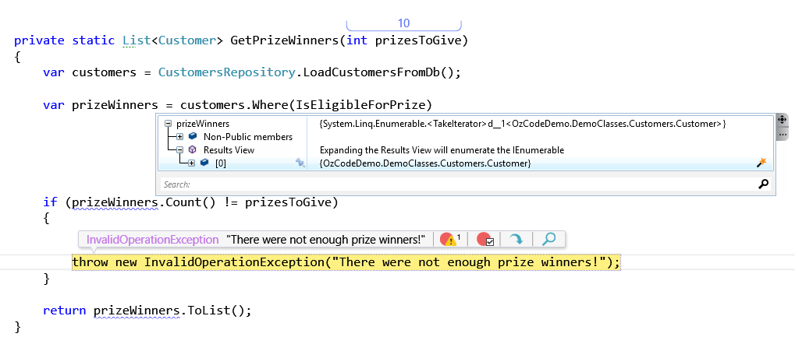
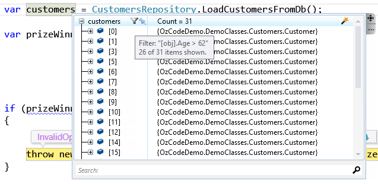
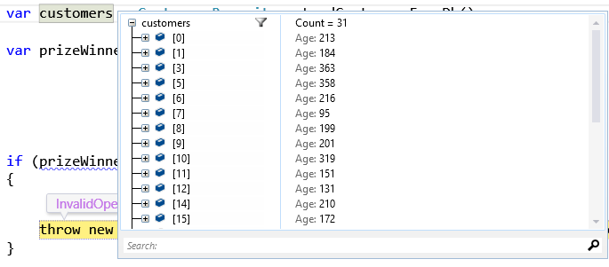

#Filter Collections
**With our Filter Collections feature, you can apply a filter expression to any collection**
##Overview
Filtering a collection in code is relatively easy and there are plenty of ways to do it. But how do you filter while debugging? For example, you have a collection of Customer objects and you’d like to filter the ones that are older than 35 years. Visual Studio’s Immediate Window and Watch Windows don’t support lambdas. With our _Filter Collections_ feature, you can apply a filter expression to any collection. To solve the customer problem, choose the collection of customers and set its filter to: DateTime.Today.Year – [obj].Birthday.Year > 35, press Enter and see the results right away. Once a collection is filtered, all the other features work on the filtered results as well.
##Using Filter Collections
In order to run this demo press the _Filter Collections_ button in the demo application.  



A message box with exception will appear (unless you are running with _Break on Exceptions_, in which case you can skip the next step)

Close the message box and use the "Break on all CLR excetions" button to stop once an exception is thrown.


Run the demo again. This time you should stop at the following method. Now it's easy to understand why the exception was thrown - we only have one eligable customer:



Looking at the code we see 31 customers going on the LINQ statement, but only one coming out.

Going through the customer collection one by one could take a while - instead lets filter it to show only the objects that follow a specific creteria.  

- Hover over the _customers_ collection 
- Click on the magic wand
- Choose __Edit Filter__


Now we can update the collection filter. using _[obj]_ as the filtered object with intellisense support.

In this case we can use the following filter to try and see if the problem is that we do not have enough customers under 62 by using:

```
[obj].Age < 62
```

Opening the Watch dialog (hover over _customers_) will show a small funnel.  

Moving the pointer over the funnel will show that only 5 customers are under 62.


Clearly we have a problem. Now let's replace the filter condition to show all of the customers over 62.



We got quite a lot of customers there. Use _Reveal_ to show the customer age by starring the _Age_ property for one of the customers:



Now all we need to do is find how the _Age_ property was calculated and fix the bug.  

 [Back to Main](../../README.md)  
