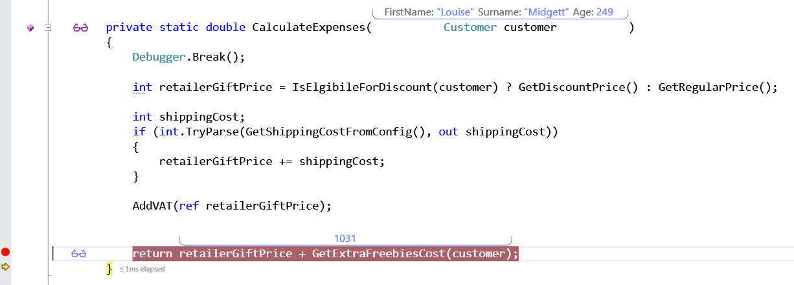
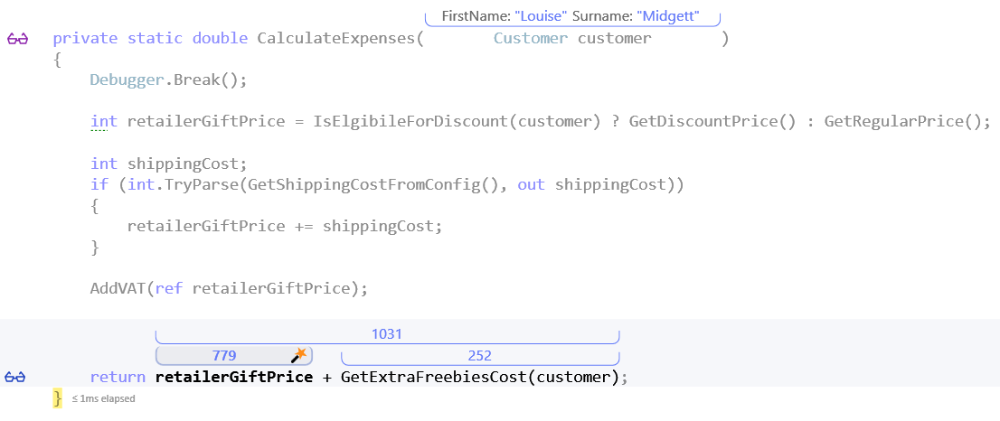
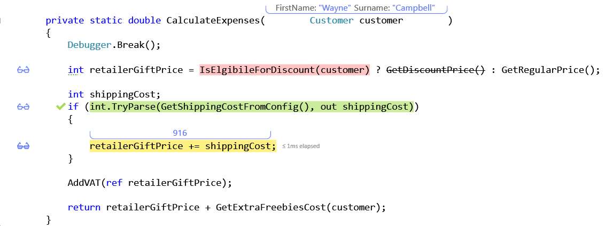
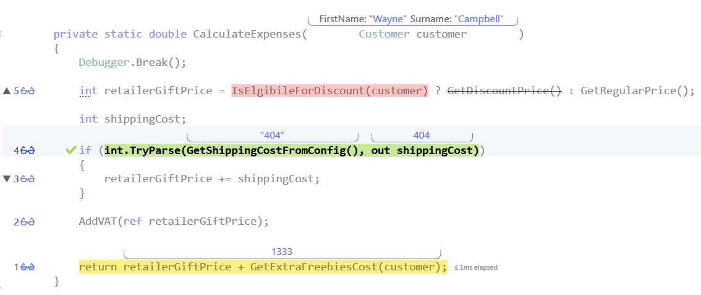
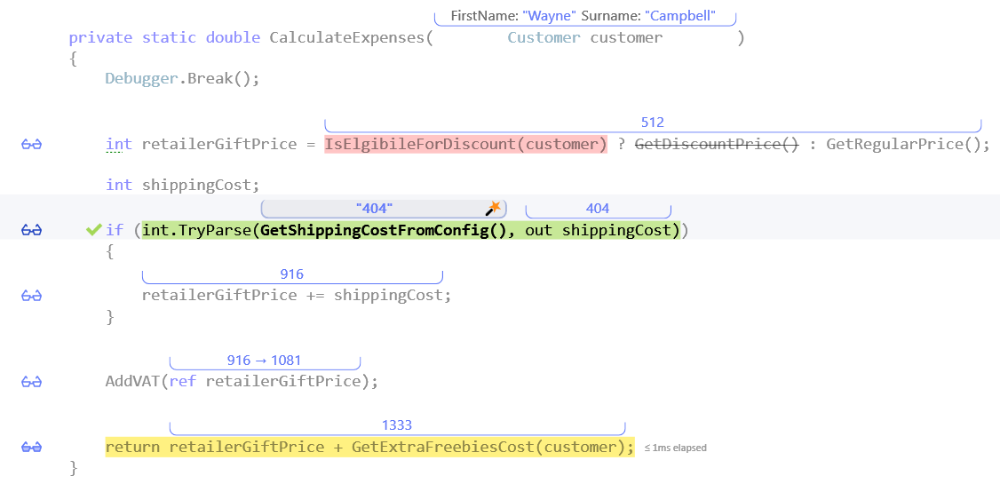

#Magic Glance
**Shows a summery of each line you've stepped through**

##Overview

**Magic Glance**, which can be toggled by clicking the toolbar icon  (or by pressing Shift + Alt + Q), gives you amazing insight into your code, by showing you a summary of each line of code you've stepped through.

##Using Magic Glance
In order to run this demo click the _Magic Glance_ button in the demo application.  

Once you stop at the begining of the method add another breakpoint at the end of the method, and press _F5_ to continue execution.
After stopping at the breakpoint press F10 (_Step Over_) - you should see the following on your screen:

There are two things to see here: 
* The returned value is displayed above the last line of the method. 
* There is a blue glasses icon to the left of the line.

Pressing the "glasses" will show a breakdown of the last line:

Now either drag the cursor to the begining of the method or press _F5_ to see the next iteration.  

This time use F10 to pass each line one by one.  

Notice how a pair of glasses appear near each line you pass? This is OzCode saving the debugged values in case you need them.

As you pass each line, the current values appear above the variables. _Boolean_ clauses are marked in green or red (true/false) and condtional paths are marked according to the execution.

Reach the last line. There are a few things you can do to analyze the last execution:

Press one of the glasses icons using the mouse, or use Alt and a number (e.c. Alt + 3) to open *Magic glance* for that line

Once in Magic Glance mode you can use the ALT + UP/DOWN arrow to move between the lines, or press escape to close Magic Glance. 

Another option is to use the Magic Glance toolbar button to toggle showing all of the HUD information automatically.

 

Try running another iteration with the toolbar enabled and see how you prefer to work.
 
[Back to Main](../../README.md) 
