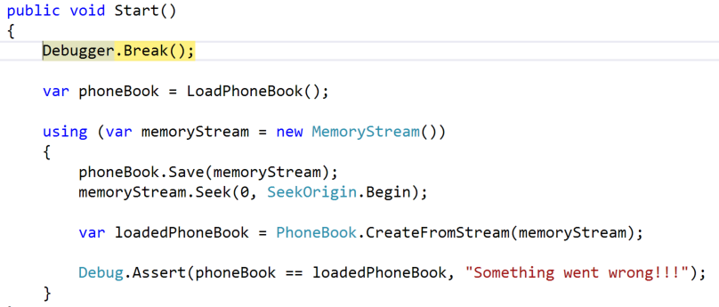
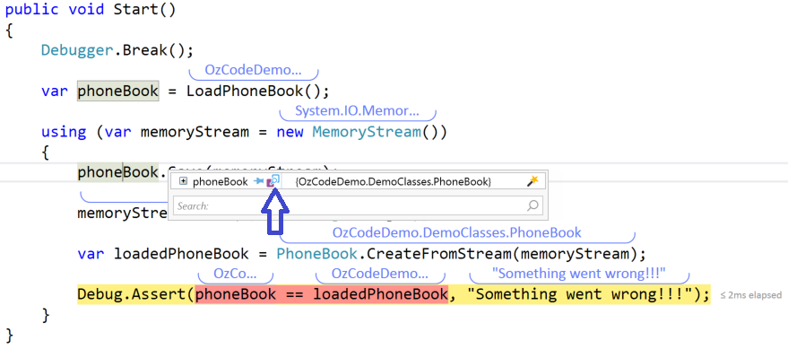
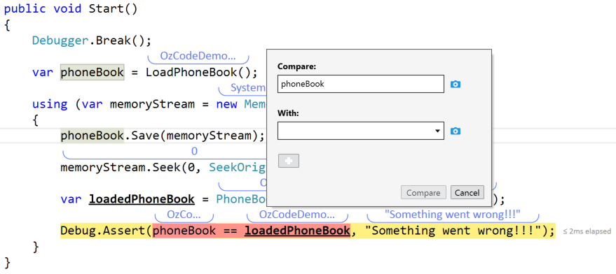
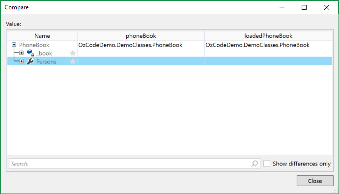
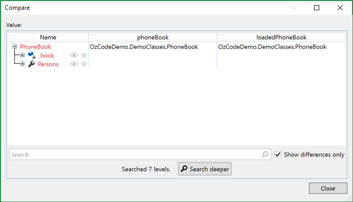
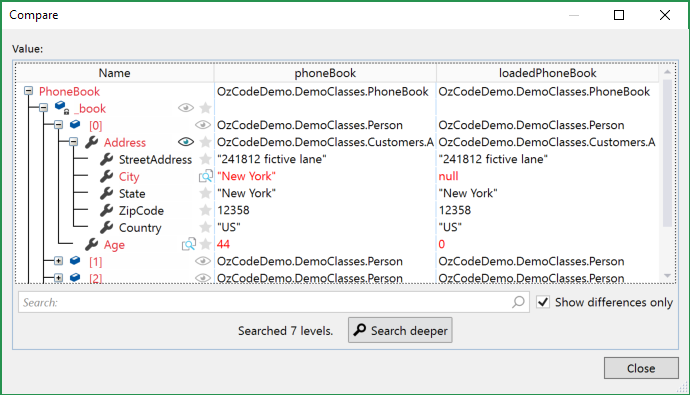

# Compare Instances

[![Download OzCode Beta][2]](http://o.oz-code.com/LINQ_EAP)
> *This feature is currently in preview*  

**When you want to compare files, you use a diff application to spot the differences. Unfortunately, when you need to compare two (or more) objects, you have to trust your eyes and memory. With our Compare feature, you can now spend less time squinting, and let OzCode Compare objects and collections with a simple click! The results are displayed in a side-by-side view that helps you investigate the differences and the similarities between the two objects.**
## Overview
In this demo an object is serilized and deserilized but the resulting object has a few different values. Using Compare we will find those differences in order to understand what changed and find the issue.
## Using Compare
In order to run this demo click the _Compare_ button in the demo application. 

You will hit a break point at the beginning of the method.

Run all the way to the *Assert* at the last line of the method without passing it. You should see that the *Assert* is about to fail because *loadedPhoneBook* is not equal to the original *phoneBook*.  
Finding the cause of this inequality can be done easily by comparing the two *PhoneBook* instances. 
First hover over *phoneBook* until the quickwatch window appear an press on the *compare this* icon.

The compare window will appear. Notice how all comparable objects (e.g. *loadedPhoneBook*)

Now choose *loadedPhoneBook* for comparison. Either using the combobox or by hovering over it and pressing the compare button (similarly to how *phoneBook* instance was selected).  
Pressing *Compare* will cause the following window to appear

 

Click on *"Show differences only"* and click on *Search deeper*. Red marks changes between the two instances:

Now you can browse the changes using the '+' signes as well as see the entire object using the *eye icons* and find out what exactly changed during serialization/deserialization.

  

[2]: Resources/beta-05.png

[Back to Main](../../README.md) 